# Reproducibility 

## Step 1 - Set Up Kaggle Credentials


- Log into a [Kaggle](https://www.kaggle.com/account/login?phase=startRegisterTab&returnUrl=%2F) 
- Go to your account **Account > Settings > API section** 

Click **Create New Token**:
  
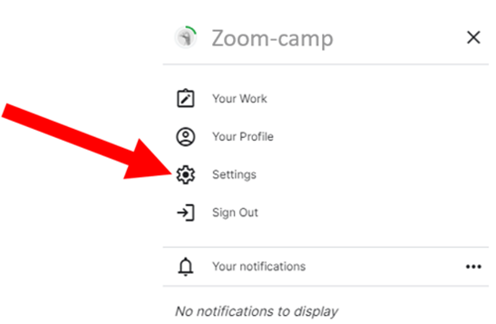
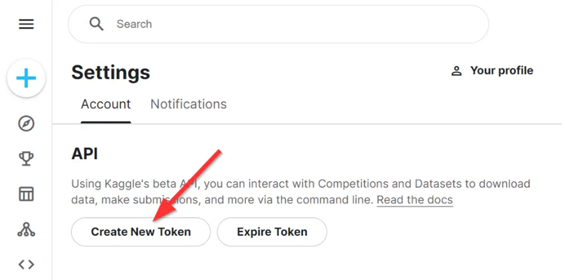

A JSON file with a username and key will be generated:

```
{
  "username": "<your_kaggle_username>",
  "key": "<your_kaggle_key>"
}

```

Save this JSON file somewhere on your local machine. 

**Note:** We’ll use this info when installing Mage on our VM in Google cloud, in **Step 5**, where we’ll add ```username``` & ```key``` from the generated JSON file to the ```.env file```.
```
kaggle_username = "< your_kaggle_username >"
kaggle_key = "< your_kaggle_key >"
```

## Step 2  - Set-Up GCP Project & Service Account Credentials


- [Log in](https://console.cloud.google.com/) into Google Cloud Platform (GCP) console. 
- Create a new project in the GCP console. 

Give the new project a name (I called mine **zoom-de-project**)
 
Make a note of the Project ID (mine is **zoom-de-project-id2**) 

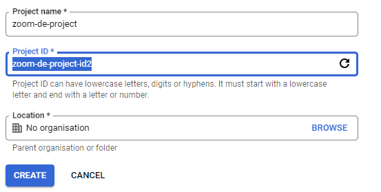

- Create an IAM Service account 

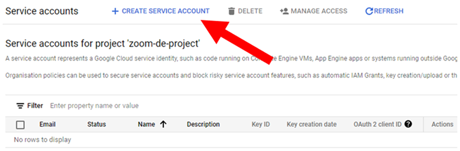

(I called mine **zoom-de-service-account**)

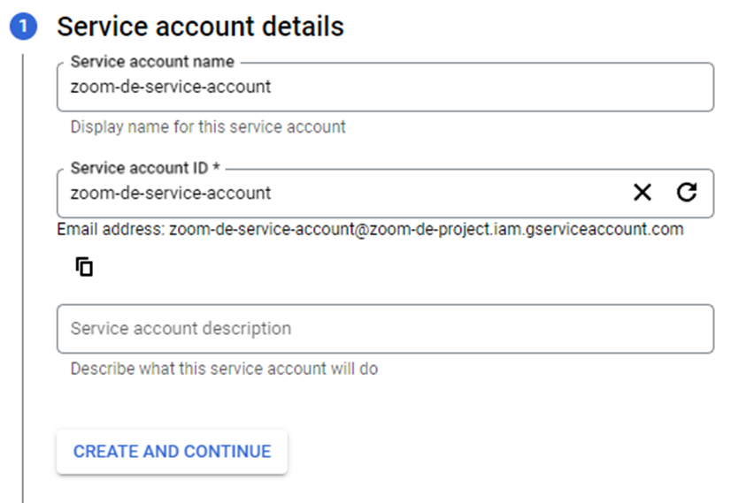
 
Press **Create And Continue** & set up the following roles:

- **BigQuery Admin**
- **Storage Admin**
- **Storage Object Admin**
- **Viewer**

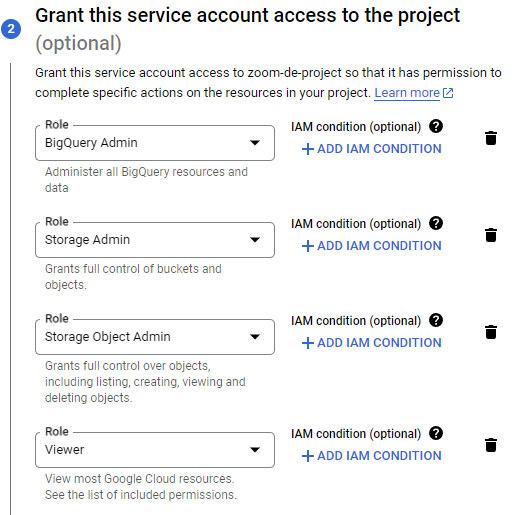

**Create Service Account key** 

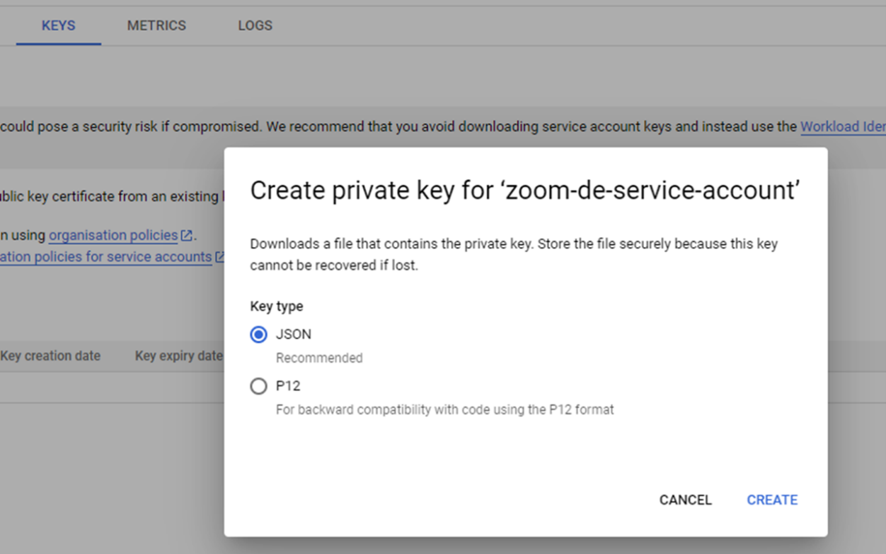

Download the Service Account Key, rename it to **gcp_auth.json** and store it in **$HOME/.gc /**

```
$HOME/.gc /gcp_auth.json
```

### We need to activate the following APIs:

- **Cloud Storage API**  
- **BigQuery API** 
- **Compute Engine API**
- **Identity and Access Management (IAM) API**
- **IAM Service Account Credentials API**

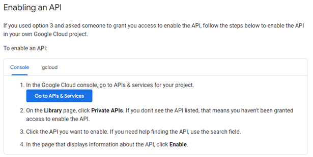

The APIs can be found [here](https://cloud.google.com/apis)

## Step 3 - Create SSH Keys to Access VM

The SSH key is used to login to our GCP VM instance.

In the GCP console, choose **Compute Engine** from the menu on the left.

Then access **Metadata** and proceed to the **SSH KEYS** tab.

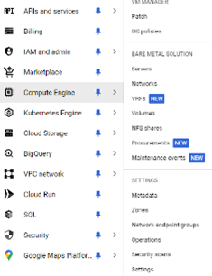
 
Click on the **ADD SSH KEY button**.

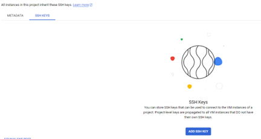

Paste the public key into the designated field and save your changes by clicking the **SAVE** button.


**Note:** To generate SSH keys for Windows 10

1.	Open the Windows 10 Start menu and search for “Apps & Features”. 
In the “Apps & Features” heading, click “Optional Features”.

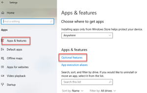
 
2.	Scroll down the list to see if “OpenSSH Client” is listed.  If not, click the plus sign next to “Add a feature”, select OpenSSH Client, and click “Install”.
 
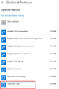

3.	In the command prompt, use the ssh-keygen command:

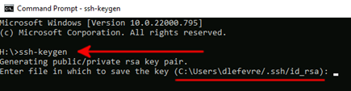

By default, the system will save the keys to **[your home directory]/.ssh/id_rsa** 

4.	The system will now generate the key pair and display the key fingerprint and a randomart image. These fingerprints are not needed in day-to-day use of your keys but can be saved to your notes to identify your keys later if needed.

5.	Open your file explorer.  You can now navigate to the hidden “.ssh” directory in your home folder. You should see two new files. The identification is saved in the id_rsa file and the public key is labeled id_rsa.pub. This is your SSH key pair. They are both saved in plain text.

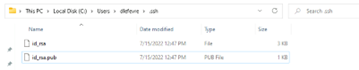


## Step 4 - Create VM

1.	From your project's dashboard, go to Cloud Compute > VM instance
2.	Create a new instance:

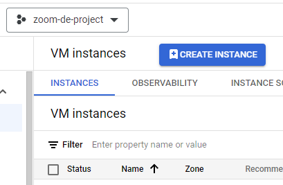


- Choose name **de-project-vm**
- Pick **Region europe-west2 (London)**
- Pick Zone **europe-west2-c**
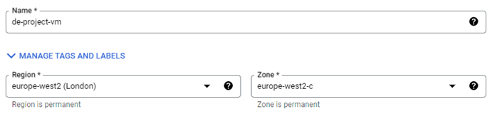
- Pick a **E2 series** instance. I went with a **e2-highmem-4 (4 vCPU, 2 core, 32 GB memory)**
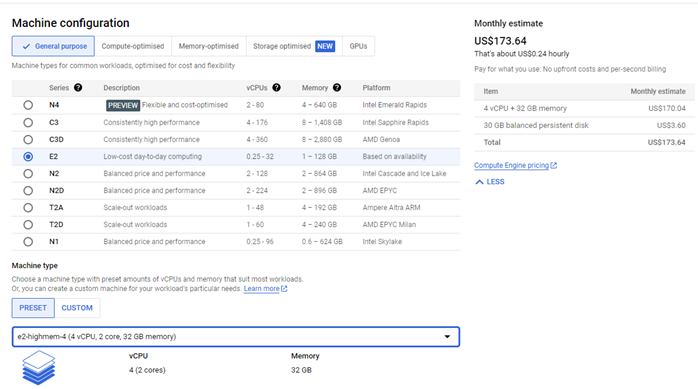
- Change the boot disk to **Ubuntu**. The **Ubuntu 20.04 LTS** version & choose 30GB of storage.
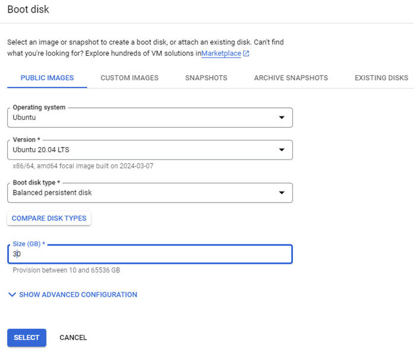
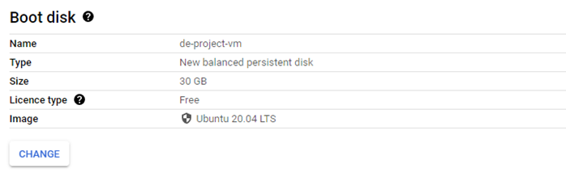
- Leave all other settings on their default value and click on **Create**.

## Step 5 - Install Packages on GCP VM Instance

- SSH into your VM 
- Clone the GitHub project repo
```
$ git clone https://github.com/BarrCoder2024/movie_lens_batch_de_project  zoom-project 
$ cd zoom-project
```
### Set environment variables for authorisation

- Setup a JSON file:
```
$ mkdir -p ~/.gc
$ touch ~/.gc/gcp_auth.json
$ nano ~/.gc/gcp_auth.json
```
[**Note:**  ctrl + O to save | ctrl+X to exit]


- Activate environment Variables:
```
$ echo 'export GOOGLE_APPLICATION_CREDENTIALS=~/.gc/gcp_auth.json' >> ~/.bashrc 
$ . ~/.bashrc
```
- **Install Docker**
```
$ cd ~  
$ sudo apt-get update  
$ sudo apt-get install -y docker.io 
$ sudo service docker.io restart
```
- **Install Docker compose** 

```
$ mkdir bin 
$ cd bin  
$ sudo wget https://github.com/docker/compose/releases/download/v2.26.1/docker-compose-linux-x86_64 -O  docker-compose  
$ sudo chmod +x docker-compose 
$ cd ~ 
$ echo 'export PATH="${HOME}/bin:${PATH}"' >> .bashrc 
$ . ~/.bashrc
$ sudo service docker restart
```


- **Install Terraform**

```
$ cd bin 
$ wget https://releases.hashicorp.com/terraform/1.8.0/terraform_1.8.0_linux_amd64.zip 
$ sudo apt-get install unzip
$ unzip terraform_1.8.0_linux_amd64.zip 
$ rm terraform_1.8.0_linux_amd64.zip
```

## Step 6 – Start up

### Using Terraform to set up GCS & BQ

To initiate plan and apply the necessary infrastructure, execute the following Terraform commands.
```
$ cd ~/zoom-project/terraform/
```
Input “project id”, bucket names etc
```
$nano variables.tf
```

```
$ terraform init
$ terraform plan   
$ terraform apply 
``` 
### Build Mage docker image with Spark environment

```
$ cd ~/zoom-project/
$ mv dev.env .env
$ nano .env
```
### Build Mage docker image with Spark environment
```
$ docker build -t mage_spark .
```
### Start Mage using docker
```
$ docker run -it --name mage_spark -e SPARK_MASTER_HOST='local' -p 6789:6789 -v $(pwd):/home/src mage_spark  /app/run_app.sh mage start mage-spark-zoom
```

### Create copy of authorisation json for docker:
```
$ cp ~/.gc/gcp_auth.json ~/zoom-project/mage-spark/gcp_auth.json
```

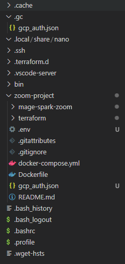

## Step 7 – Running the Pipeline

- Access the Mage AI web interface by typing in your browser the following URL http://localhost:6789/.

- Click on the **Pipelines** option on the left-hand side.

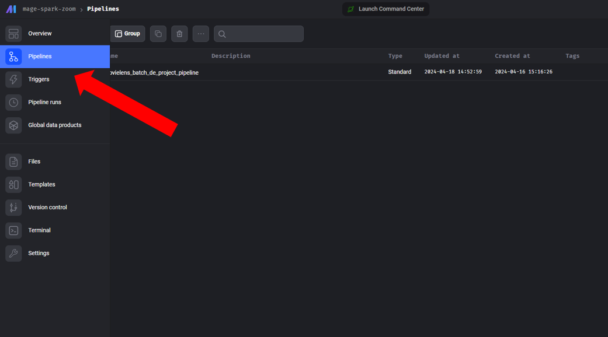

- Click on the **movielens_batch_de_project_pipeline**.

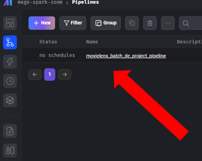

- Click on the **Edit pipeline** option on the left-hand side.

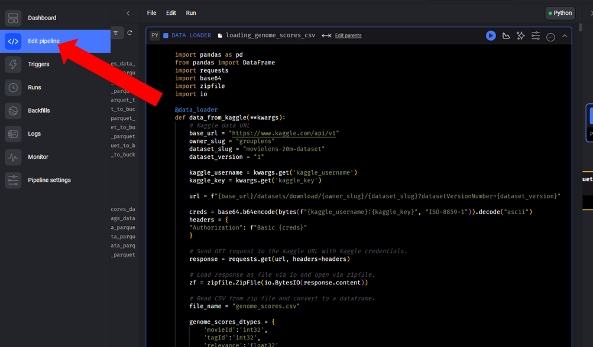

- Click on the **Run block** option on the left-hand side.

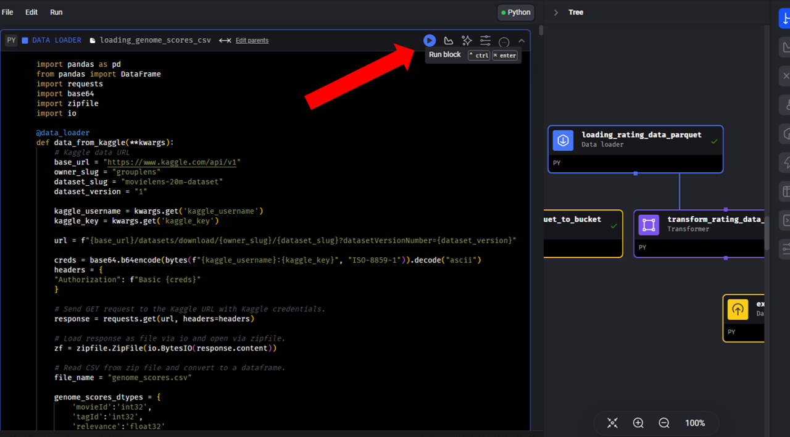

- **Note:** Currently investigating why triggers are failing!

## Step 8 – Take a look at the uploaded data

From your project's dashboard, go to Cloud Storage > Buckets

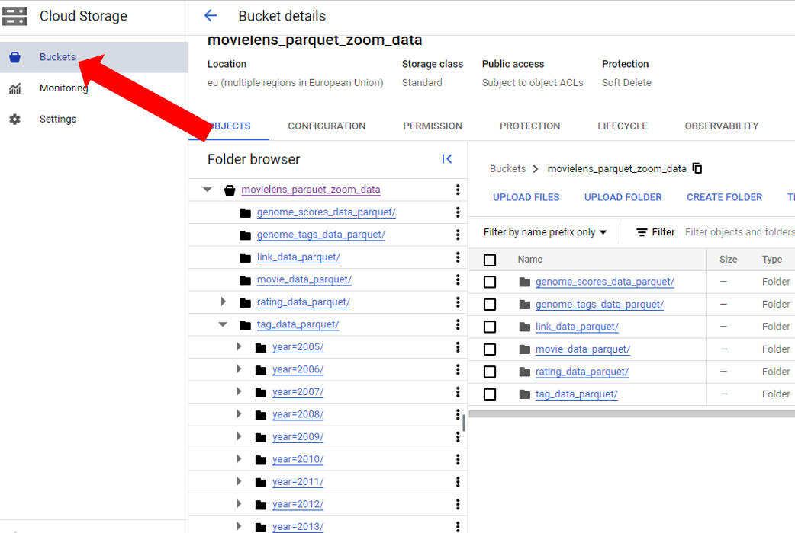

From your project's dashboard, go to BigQuery Studio.

On the left handside click on the project ID **zoom-de-project-id2**

On the left handside click on the dataset **movielens_zoom_dataset**

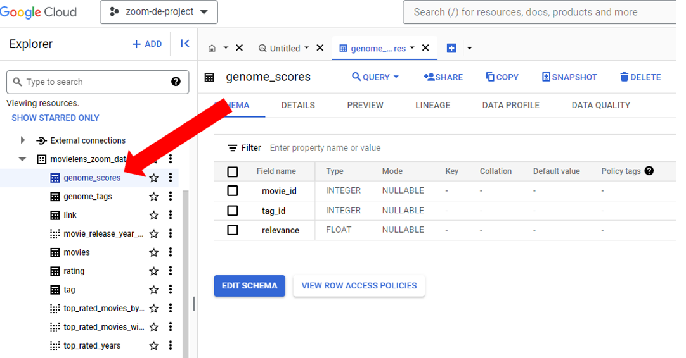


## Step 9 – Shut it all down!

- Shut down the docker image by typing in the terminal:
```
$ Sudo stop mage_spark
```
or
```
$ Sudo kill mage_spark
```

- Shut down all Google Cloud Services:

```
$ terraform destroy
```


